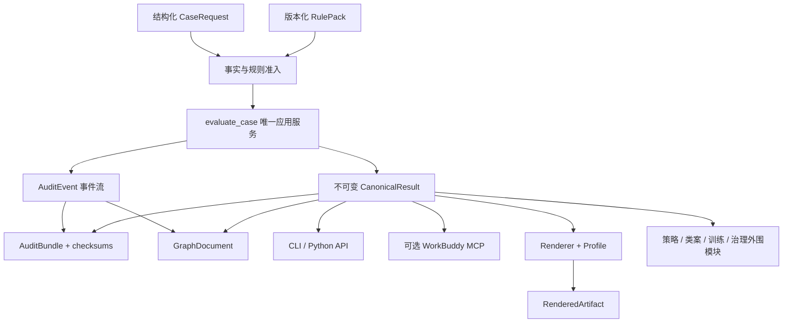

# JC v3 全量改造实施计划

> 文档状态：实施前基线稿
>
> 适用仓库：`juris-calculus`
>
> 目标版本：v3 breaking architecture
>
> 默认执行边界：只做本地修改、测试和提交；不推送、不打 tag、不创建 release
>
> 决策优先级：正确性 > 审计性 > 单一简单架构 > 独立分发 > 向后兼容 > 功能丰富

## 1. 目标和完成定义

[有理有据的][高等] 本次改造不是把现有33项MCP机械地改成33个CLI命令，而是把JC收缩为一个可独立安装、可确定性调用、可审计重放的法律推理内核，并删除多代入口、平行对象和越权表现层。

[有理有据的][高等] 改造完成必须同时满足以下条件：

1. 所有正式求值都进入唯一应用服务 `evaluate_case(request, audit_writer=None)`；`None`表示使用平台默认本地writer，不表示关闭审计。
2. `verified_fact`、Horn、attack、exception、permission、priority、checker、certificate和fail-closed语义未被削弱。
3. 默认外部接口是CLI；Python API直接调用同一应用服务；默认安装不注册MCP。
4. WorkBuddy仅通过可选适配器使用四项薄MCP工具，适配器不包含推理逻辑。
5. 每次正式求值生成可验证完整性的本地审计包，并可离线重放。
6. `graph.json`由同一事件流派生，禁止重新求值或伪造相邻事件因果关系。
7. 人类文本和个人风格只作用于不可变正式结果之后，不得改变任何法律状态。
8. CN官方规则包只有在一手来源、内容哈希和准入审计全部完成后才能使用“官方”名称。
9. 策略、类案、训练和规则治理作为官方分发的ADVISORY/治理模块存在，但不得晋升或改写正式certificate。
10. Python 3.11与3.12完整测试、干净wheel安装、CLI subprocess、审计重放、供应链门禁全部通过。

## 2. 不可突破的边界

### 2.1 必须保留的正式语义

- `verified_fact`准入门禁。
- 既有Horn闭包和截断语义。
- attack、exception、permission和priority语义。
- checker接受条件和certificate含义。
- 红灯场景、候选事实、无来源规则的fail-closed行为。
- 上游形式规格与JC runtime之间的证据等级边界。

[有理有据的][高等] 如果实施中发现必须改变以上任一语义，该工作包立即停止；先在上游 `legal-math-modeling` 定规格，再回到JC实现，不得在renderer、CLI或兼容层里偷偷改变结果。

### 2.2 明确不做

- 不建设Web应用或常驻服务。
- 不默认生成HTML。
- 不引入数据库；SQLite只保留未来可选索引位置。
- 不建设逐事件区块链式哈希链。
- 不让JC承担OCR、卷宗摄取或LLM事实自动晋升。
- 不为33项旧MCP保留第二套运行时兼容实现。
- 不把私人客户数据、个人profile、律所模板或绝对机器路径提交到公开仓库。
- 不把诉讼策略、类案建议或个人文风写入Horn/checker。
- 不预建插件框架、事件总线、repository pattern或远程规则服务。

## 3. 目标架构



[有理有据的][高等] 允许存在多个适配入口，但只允许存在一个正式执行体、一个事件记录器、一个图构建器和一个renderer。

## 4. 目标文件边界

### 4.1 最少新增文件

| 文件 | 唯一职责 |
|---|---|
| `compiler_core/contracts.py` | CaseRequest、CanonicalResult、AuditEvent、GraphDocument、RenderedArtifact、profile和错误schema |
| `schemas/jc-v3.schema.json` | 单文件JSON Schema，使用`$defs`公开CLI/MCP输入输出契约；由测试保证与contracts一致 |
| `compiler_core/application.py` | 唯一 `evaluate_case()` 编排；不重复底层Horn/AAF实现 |
| `compiler_core/rule_pack.py` | pack manifest、hash、source snapshot、inventory和缓存键 |
| `compiler_core/audit.py` | recorder、审计包写入/读取、checksums和语义重放；首版不另拆replay层 |
| `compiler_core/graph.py` | 从events/result构建确定性GraphDocument |
| `compiler_core/rendering.py` | 中性renderer、声明式profile和输出防火墙 |
| `compiler_core/cli.py` | stdlib argparse CLI；只调用application/audit/render/rule-pack服务 |
| `addons/analysis.py` | strategy与similar-case只读artifact分析；不进入推理内核 |
| `configs/render_profiles/neutral.yaml` | 公开中性profile；不含个人或客户信息 |
| `pyproject.toml` | 包元数据、console script、依赖和可选extras |

[有理有据的][高等] 上表不是要求一次性创建所有文件。每个文件只在对应工作包开始时创建；如果现有模块可以承担同一职责且不会继续平行语义，应优先改造现有模块。

### 4.2 必须复用的现有实现

| 能力 | 主要现有文件 | 复用方式 |
|---|---|---|
| Horn求值 | `compiler_core/evaluator.py` | 作为底层求值器，由application调用 |
| 分层求值 | `compiler_core/stratified_evaluator.py` | 评估是否合并为application内部stage；不得保留公开入口 |
| 事实准入 | `compiler_core/fact_trust_envelope.py` | 将状态与准入逻辑合并进LegalFact契约 |
| 规则准入 | `compiler_core/types.py`、`tools/rule_quality_auditor.py` | 保留candidate-only与inventory逻辑，增强source hash校验 |
| Checker | `compiler_core/certificate_checker.py`及独立checker测试 | 保持接受语义不变，只接统一结果 |
| Argumentation | `compiler_core/argumentation.py`、独立grounded checker | 保持攻击和grounded语义不变 |
| ProofTree | `compiler_core/proof_tree.py` | 作为中立推理结构，不负责个人表达 |
| Boundary status | `compiler_core/lsc_boundary_status.py` | 迁移为无LSC名称的统一ResultStatus，值和语义先保持 |
| Canonical序列化 | `compiler_core/canonical_serialization.py` | 扩展到CaseResult；先修复原地修改输入 |
| 输出防火墙 | `compiler_core/output_firewall.py` | 扩展为递归和受保护章节校验 |
| 图结构 | `compiler_core/audit.py` | 从审计事件构建唯一正式GraphDocument |
| 供应链三态 | `tools/supply_chain_gate.py` | 保留PASS/FAIL/BLOCKED和非零退出语义 |

### 4.3 删除或迁出的主要实现

| 当前实现 | 最终处置 |
|---|---|
| `mcp_server.py`中的legacy evaluate wrappers | 删除独立求值体；可选MCP只调用application |
| `compiler_core/post_freeze_surface.py`中的toy evaluate/render/check | 从正式surface删除；必要fixture留在tests |
| `compiler_core/litigation_renderer.py::evaluate()` | 求值部分迁入application；必要渲染内容合并到rendering |
| `compiler_core/automated_pipeline.py`重复Horn/AAF链 | 改为消费CanonicalResult或删除 |
| `compiler_core/proof_trace_visualizer.py` | 删除；不能继续把相邻事件伪装成因果边 |
| `compiler_core/result_exporter.py`多种重复自然语言导出 | JSON能力并入contracts/rendering；无消费者格式删除 |
| `tools/action_agent/`与`partners_memo.j2` | 迁出公开内核；属于律师工作流和策略层 |
| 固定toy memo及“合伙人可签字”文案 | 删除，不作为个人风格基础 |

## 5. 全局执行规程

### 5.1 开始任何工作包之前

1. 确认当前分支、HEAD和工作树状态。
2. 记录用户已有未提交改动；不得覆盖或回退。
3. WP0.1负责从当前HEAD创建 `codex/jc-v3-auditable-cli`；从WP0.2开始，每个工作包先确认仍在该分支。
4. 运行并记录基线命令、Python版本和准确pass/skip数。
5. 为当前工作包建立窄测试，先证明旧行为或复现缺陷。
6. 搜索所有调用方，禁止只改报告中出现的单一入口。
7. 若触及正式语义，执行route-back判断。

### 5.2 每个工作包的固定完成条件

- 代码、schema和文档一致。
- 窄测试通过。
- 受影响的既有测试通过。
- Phase 0只有在完整`tests/`通过时才能提交；若出现pre-existing失败，先记录并根治或明确环境BLOCKED，Phase 0不得假完成。Phase 1以后每个提交同样要求完整`tests/`通过。
- `git diff --check`通过。
- 提交说明包含：改动文件、根因、新项目知识、影响范围、验证结果和剩余风险。
- 项目 `memory.md` 只在关闭真实bug或形成稳定项目知识时更新。

### 5.3 固定停止条件

出现以下任一情况，不得继续合并或删除旧入口：

- 新旧结果在Horn、attack、exception、permission、priority或checker上出现无法解释的差异。
- 候选事实或无来源规则进入正式结果。
- replay只能“重新运行命令”而不能校验语义事件和结果。
- renderer改变CanonicalResult或重新调用evaluator。
- 规则包hash、source hash或schema版本无法确定。
- 供应链、网络或代理失败被包装成PASS。
- 工作树中出现无法与用户改动安全分离的重叠修改。

## 6. Phase 0：基线冻结与迁移清单

### WP0.1 建立实施分支和基线报告

**前置条件**：主Agent先逐个读取所有当前ahead-of-origin提交的diff、提交信息和既有验证记录，确认它们属于实施前的有效闭环；任一提交来源或意图不清时先向用户确认，不创建实施分支。

**动作**：

1. 记录 `git status --short --branch`、`git log -6 --oneline`和Python 3.11/3.12版本。
2. 创建 `codex/jc-v3-auditable-cli`，不改写现有main历史。
3. 运行三个推荐窄测、完整tests、MCP进程内smoke、真实stdio smoke、三轨矩阵、供应链门禁和`git diff --check`。
4. 将准确命令、退出码、pass/skip、耗时和blocked项写入新的实施日志，不修改有日期历史报告。
5. 若完整tests失败，Phase 0停在BLOCKED/修复状态；“pre-existing”只用于归因，不构成允许带失败提交的豁免。

**验收**：得到可重复的旧系统基线；任何预存失败明确标成pre-existing，不得删除测试掩盖。

### WP0.2 冻结正式语义差分fixture

**涉及文件**：

- 复用 `tests/unit/test_spec_shadow_harness.py`
- 复用 `tests/unit/test_nonmonotone_regression.py`
- 复用 `tests/test_argumentation_b6.py`
- 新增 `tests/unit/test_v3_semantic_baseline.py`

**动作**：

1. 选择覆盖obligation、prohibition、permission、exception、attack、priority、冲突、截断和checker拒绝的最小fixture集合。
2. 保存语义字段，不保存时间戳、临时路径或随机ID。
3. 对每个fixture记录used facts、used rules、claims、攻击边、优先级结果、checker verdict和result status。
4. 这些fixture只用于证明语义未弱化，不把当前错误元数据固化为规范。

**验收**：新应用服务上线前后，所有受保护语义字段完全一致；差异必须逐项解释。

### WP0.3 建立求值入口和调用方台账

**必须覆盖**：MCP legacy wrapper、`FixpointEvaluator`、`StratifiedEvaluator`、`automated_pipeline`、`litigation_renderer`、`pipeline/pipeline.py`、PRC collision、三轨、视差、shadow、batch、DACL和相关tools。

**动作**：

1. 记录每个入口的输入形态、规则加载路径、状态对象、输出字段和调用者。
2. 给每个入口标记：迁入application、改为adapter、降为CLI/CI、删除。
3. 没有调用方的入口仍需检查测试和文档消费者，不能仅凭`rg`无结果删除。

**验收**：所有直接构造 `FixpointEvaluator` 的生产调用点都有迁移决定。

### WP0.4 建立33工具与12资源迁移表

[计算生成的][高等] 当前manifest包含33项工具和12项resources。Phase 7删除前必须先以本文件第13节的逐项表为验收依据。

### WP0.5 建立数据和隐私基线

**动作**：

1. 扫描跟踪文件中的绝对路径、客户名、私有案情、凭证和个人profile。
2. 记录现有规则文件、source manifest和报告的hash及文件大小。
3. 确认当前不存在需要保持运行时兼容的v2审计包格式；如发现真实外部数据，再增加一次性迁移方案。

**验收**：公开仓库边界清晰；未发现的数据不得在计划中假设存在。

### Phase 0 门禁

- **通过**：旧基线可重复、差分fixture完成、入口台账闭合、迁移表闭合。
- **不得继续**：基线测试失败原因不明，或无法区分用户改动与计划改动。
- **提交1**：`test: freeze v2 semantic and migration baselines`。

## 7. Phase 1：Canonical contracts与输入准入

### WP1.1 统一状态词典

**现状问题**：runtime没有统一名为`DecisionStatus`的实现，状态分散在`BoundaryResultStatus`、`CompletionStatus`和字符串中。

**动作**：

1. 枚举全部result/decision/execution状态及消费者。
2. 在 `compiler_core/contracts.py` 定义唯一 `ResultStatus`，首轮保持现有值：`accepted_formal_result`、`hypothetical_result`、`review_only_result`、`missing_required_fact`、`conflict_certificate`、`engine_error`。
3. 单独定义 `ExecutionStatus`，只表示程序是否完成、被准入阻断或发生引擎错误。
4. `formal_kernel_used`和`review_required`继续作为显式布尔字段，不从文案推断。
5. 删除活跃名称中的LSC；旧类名只允许在迁移提交内作为短期别名，最终提交前删除。

**测试**：新增 `tests/unit/test_case_contracts.py`，覆盖枚举序列化、未知值、状态组合和旧值映射。

**验收**：同一概念只有一个runtime状态定义；任何非法组合fail closed。

**合法结果矩阵**：

| ResultStatus | ExecutionStatus | review_required | certificate_kind | 关键约束 |
|---|---|---:|---|---|
| accepted_formal_result | completed | false | formal | checker必须accepted，formal_kernel_used必须true |
| hypothetical_result | completed | true | none | USER_ASSUMED/taint显式存在，禁止formal certificate |
| review_only_result | completed | true | none | 可执行过部分formal kernel，但checker不得accepted |
| missing_required_fact | completed | true | none | missing facts非空，禁止formal certificate |
| conflict_certificate | completed | true | conflict | 只允许machine conflict certificate，不是formal conclusion |
| engine_error | engine_error | true | none | 不得包含accepted claim/certificate |

[有理有据的][高等] `formal_kernel_used`由实际事件推导，不简单等同于ResultStatus；fast path必须false，accepted formal result必须true，其余状态按是否真实执行正式规则记录。

### WP1.2 将FactCoordinate能力并入LegalFact

**修改文件**：`compiler_core/types.py`、`compiler_core/fact_trust_envelope.py`及对应LSC边界测试。

**动作**：

1. 给`LegalFact`增加status、source_ids、alternatives、provenance、human_reviewed和created_by。
2. 保留现有taint、confidence、carrier和source anchor字段。
3. 将`can_enter_formal_kernel()`迁为LegalFact准入函数；只有verified且满足来源/人工或法院条件者默认准入。
4. `USER_ASSUMED`标记假设taint；`UNKNOWN`进入missing facts；`DISPUTED`产生确定性分支。
5. 删除`FactTrustEnvelope`平行存储；如果需要解析旧payload，仅保留纯转换函数，不保留第二个业务对象。
6. 字段名使用`reasoning_tier`，值为P0/P1/P2，只写路由/审计元数据，不参与正式准入判断；避免与缺陷严重级别P0/P1/P2混为同一概念。

**测试**：迁移并扩展 `test_lsc_boundary_fact_trust_envelope.py`，最终重命名为 `test_fact_admission.py`。

**验收**：同一事实只有一个权威runtime对象；候选、未知、争议和假设事实均不能直接生成正式certificate。

### WP1.3 删除隐藏默认事实

**修改文件**：`compiler_core/types.py`及所有依赖`temporal_scope/state_tracker`默认值的测试和工具。

**动作**：

1. 删除默认案件日期 `2021-03-15`。
2. 删除默认适用法 `PRC_CivilCode_2021`。
3. 删除默认 `Contract_Validity=VALID`。
4. `world_id="W1"`不再作为跨案公共ID；application按request/branch digest显式生成world/branch ID。
5. 将jurisdiction、governing law和as-of date变成CaseRequest显式字段。
6. 必要事实缺失时返回input error或review-only/missing fact，不猜测“合同有效”。
7. 三轨fixture需要该事实时，在fixture中明确填写，不通过IRState注入。

**测试**：`tests/unit/test_case_admission.py`覆盖缺日期、缺适用法、缺效力、显式输入和旧fixture迁移。

**验收**：空IRState不带任何实体法律结论或日期假设。

### WP1.4 定义CaseRequest

**最小字段**：`schema_version`、`jurisdiction`、`governing_law`、`as_of_date`、`facts[]`、`rule_pack_id`、pack version/content digest和`external_source_refs[]`。

**动作**：

1. 使用stdlib dataclass和显式validator，不为此新增Pydantic依赖。
2. 拒绝未知顶层字段、未知fact status、重复fact key、非法日期、空jurisdiction和超出容量限制的请求。
3. 原始文件只允许记录hash、外部引用和必要摘要，不复制完整卷宗。
4. facts输入顺序不得影响semantic digest。
5. 分支数量、事实数量和文本长度使用固定engine limits；具体数字由Phase 0基线/压力测试确定并写入单一engine manifest，未提交数值前Phase 1不得关闭。
6. 语法/大小超限返回退出码2；合法DISPUTED事实导致的组合分支超出预算时返回review-only、`BRANCH_LIMIT_EXCEEDED`且禁止formal certificate，不允许实现者自行二选一。
7. `contracts.py`是schema事实源，提供确定性`schema_document()`；`python -m compiler_core.contracts --write-schema`生成已提交JSON Schema，CI重新生成并要求零diff，MCP直接消费同一schema document。

**测试**：schema合法/缺字段/额外字段/重复事实/非法枚举/顺序不变/容量上限。

### WP1.5 定义CanonicalResult

**最小字段**：schema/run/result digest、execution/result status、formal kernel/review flags、claims和branches、used facts/rules/sources、missing facts、taint/risk、certificate/checker、artifact refs及engine/pack版本。

**动作**：

1. 所有列表确定性排序。
2. 正式结果只引用真实使用事实、规则和来源。
3. 空claims、候选来源、checker拒绝和引擎异常不得包装成accepted formal result。
4. `DISPUTED`分支按稳定branch ID排序；任一分支不得自动升级为整体正式certificate。
5. SemanticResult/CanonicalResult使用frozen dataclass、tuple和嵌套不可变dataclass；构造时深复制输入，`to_dict()`每次返回新对象。禁止在冻结对象内保留可变list/dict。

**测试**：非法状态组合、空成功、候选污染、分支、缺失事实、checker拒绝和序列化round-trip。

### WP1.6 修复canonical serialization与ID

**修改文件**：`canonical_serialization.py`、`litigation_renderer.py`、`automated_pipeline.py`、`batch_processor.py`、`evidence_checklist.py`及所有公共ID生成点。

**动作**：

1. 深度构造规范投影，禁止序列化函数修改传入rule body或facts。
2. 以SHA-256规范内容生成case/run/result/trace ID；禁止Python进程随机`hash()`进入公共输出。
3. semantic digest排除时间戳、输出路径、PID和临时目录。
4. digest对象不包含digest自身，避免循环。
5. 对不同`PYTHONHASHSEED`、时区、输入排列和独立进程做字节级比较。

**测试**：扩展 `tests/test_canonical_serialization.py`，新增 `tests/unit/test_cross_process_determinism.py`。

**验收**：同一语义输入在独立进程产生相同semantic digest，输入对象保持不变。

### WP1.7 建立基础output firewall契约

1. 定义CanonicalResult与RenderedArtifact的单向边界。
2. 递归禁止伪造来源、隐藏certificate、嵌套final conclusion和修改风险状态。
3. 定义受保护字段和章节allowlist。
4. 本阶段只建立契约和中性校验，不实现个人profile。

**测试**：扩展renderer firewall测试，覆盖嵌套对象、正文确定意见和输入对象未修改。

### WP1.8 定义阶段依赖用的最小契约

1. 在contracts中定义`RulePackDescriptor`，只描述pack ID/version/digest和已验证规则集合；完整resolver/hash实现留到Phase 3。
2. 定义`emit_audit_event(event)`回调形态，不建立event bus或writer interface层；Phase 2测试使用内存list sink，Phase 4的`audit.py`提供正式持久化实现。
3. 定义不含artifact refs的`SemanticResult`投影，CanonicalResult的artifact envelope在Phase 4最终化。
4. application在Phase 2保持内部实验入口，不从`compiler_core.__init__`、CLI或MCP公开，直到Phase 4审计/graph完整。

### Phase 1 门禁

- **通过**：统一contracts、单一LegalFact、无隐藏默认、SHA-256稳定、准入fail closed。
- **不得继续**：新增状态改变checker/Horn语义，或旧随机ID仍出现在公共结果。
- **提交2**：`refactor: unify case contracts and fact admission`。
- **提交3**：`fix: remove hidden legal defaults and random public ids`。

## 8. Phase 2：唯一evaluate_case执行核心

### WP2.1 建立application service

**新增/修改文件**：`compiler_core/application.py`、`evaluator.py`、`stratified_evaluator.py`。

**固定执行顺序**：

1. 解析并验证CaseRequest。
2. 接收已验证`RulePackDescriptor`；正式pack resolver在Phase 3接入。
3. 对事实执行准入分类。
4. 建立每案独立IRState，并向调用者提供的内存audit sink发送事件。
5. 构造UNKNOWN缺失事实和DISPUTED分支。
6. 调用现有正式求值器。
7. 收集attack、exception、permission、priority和taint事件。
8. 调用独立checker。
9. 生成不含artifact refs的SemanticResult。
10. 执行最终状态一致性校验。

**阶段限制**：Phase 2只在差分测试中调用该入口，不作为已完成产品API；Phase 4完成持久化审计、graph和finalization后才导出正式`evaluate_case()`。

[有理有据的][高等] application只负责编排，不重新实现Horn、AAF或checker算法。

### WP2.2 每案状态隔离与规则缓存

1. evaluator实例、IRState、audit recorder、branch state每案新建。
2. 只缓存以pack content digest为key的不可变已编译规则索引。
3. pack变化、开发覆盖或source manifest变化自动使缓存失效。
4. 禁止缓存audit log、claims或case state。

**测试**：连续两案、并行两案、先错误后成功、不同pack和同pack热运行，均不得串案。

### WP2.3 接入正式checker和certificate

1. application只接受checker明确accepted的certificate。
2. hypothetical、unknown、disputed、candidate、conflict和engine error均不得产生正式certificate。
3. conflict certificate作为机器冲突包接入现有certificate体系，不另建证明系统。
4. checker异常必须成为engine error并保留审计事件。

### WP2.4 准备核心调用点迁移与差分

按以下顺序为每个入口建立adapter/differential测试，但本阶段不切换生产入口、不删除旧执行体：

1. `mcp_server.py::evaluate_facts`和legacy wrappers。
2. `compiler_core/litigation_renderer.py::evaluate()`。
3. `compiler_core/automated_pipeline.py`。
4. `compiler_core/stratified_evaluator.py`公开入口。
5. `compiler_core/prc_collision_engine.py`。
6. `tools/run_trirail_matrix.py`。
7. DACL、SMT和其他保留的直接evaluator对照工具。
8. `pipeline/pipeline.py`及其全局ENGINE/文档摄取后求值路径。

**最终迁移原则**：工具可循环调用application，但不得直接持有第二套规则加载、IRState默认或checker逻辑。实际切换和删除在WP4.9执行。

**允许的低层直调**：evaluator单元测试、spec-shadow、SMT differential和independent checker可继续直接调用stage API，因为它们验证内部语义且不生成正式CanonicalResult；不得把这些测试入口重新暴露为产品API。

### WP2.5 清理来源猜测路径

1. 删除PRC collision中用rule description充当source anchor的路径。
2. 所有source snapshot ID必须来自已验证manifest条目。
3. `SourceManifest`默认必须是未验证；只有显式verified记录和内容hash可以晋升。
4. 删除`sid in anchor`、`startswith`等宽松匹配，改为结构化source ID精确匹配。
5. 没有来源的规则保留candidate-only，可训练导出，不进入正式索引。
6. 任何兼容转换都不得从名称、描述或法条常识猜来源。

### WP2.6 建立重复执行体删除清单

**删除门槛**：Phase 4审计和graph完成、调用台账已归零、差分fixture通过、没有文档或测试引用旧入口。

**候选**：legacy wrappers、toy evaluate/check、renderer evaluate、automated pipeline自建链、旧PRC override和无消费者adapter。本阶段只记录，不删除。

### Phase 2 门禁

- **通过**：内部application通过受保护语义差分；所有生产调用点已有迁移测试和明确处置。
- **不得继续**：application自身语义与旧正式路径出现无法解释的差异。
- **提交4**：`refactor: establish the single evaluate_case application service`。

## 9. Phase 3：CLI、打包和规则包治理

### WP3.1 建立标准Python包

1. 新建`pyproject.toml`，明确Python `>=3.11,<3.13`。
2. 建立console script：`jc = compiler_core.cli:main`。
3. 将YAML规则、neutral profile和必要配置声明为package data。
4. core依赖只保留真实runtime必需项；DOCX、PDF、Jinja和MCP移入extras或外围工具。
5. 在干净venv构建wheel并从wheel安装，禁止只测editable source tree。
6. wheel必须包含JSON Schema、neutral profile和实际发布pack manifest。

### WP3.2 建立CLI骨架

**实现方式**：stdlib `argparse`，不新增Click/Typer。

```text
jc rules lookup
jc packs list
jc packs verify
jc doctor
```

- `--json`时stdout只输出JSON；日志和诊断只写stderr。
- `--input -`支持stdin；文件路径必须显式。
- 默认audience为agent，不自动生成律师文本。
- Phase 3只注册本阶段已经实现的lookup/packs/doctor；`evaluate/replay/render`分别在Phase 4/5完成后注册。
- 不创建尚未实现的strategy/similar/training/governance占位命令。

### WP3.3 固定CLI错误和退出码

| 退出码 | 含义 |
|---|---|
| 0 | 命令执行成功，包括合法的review-only/hypothetical/missing/conflict结果 |
| 2 | CLI用法或输入schema错误 |
| 3 | 进入内核前被规则包、来源或事实准入完整性阻断 |
| 4 | 引擎或checker失败 |
| 5 | replay不一致或审计包被篡改 |
| 6 | 可选pack、renderer或WorkBuddy adapter未安装 |

**机器错误schema**：`code、message、details、retryable`。不得把Python traceback写入stdout或MCP结果。

### WP3.4 建立RulePack manifest

每个pack manifest至少包含：pack ID/version/schema、jurisdiction/governing law/effective dates、rule/source files逐项hash、三类inventory、content digest和build commit。

**动作**：

1. 在现有法域目录旁增加manifest，不先大规模移动13MB规则文件。
2. 精确匹配source ID/hash；禁止子串匹配。
3. 拒绝重复rule ID、重复pack、非法日期、digest不符和`_meta.total`不一致。
4. `JURIS_CONFIG_DIR`仅允许显式development模式；正式结果记录覆盖路径hash和`development_override=true`。
5. 清理`configs/en_US/rules.yaml`空包与`US_Adapter.yaml`双默认歧义：删除空包或写明tombstone，法域只能解析到一个默认pack。

### WP3.5 建立CN官方包晋升门禁

[有理有据的][高等] “官方CN规则包”是目标名称，不是给现有生成语料改文件名。

1. 将现有大语料标记为legacy/candidate corpus，继续允许训练和清洗读取。
2. 逐条核对source snapshot是否来自官方一手权威文本并带内容hash。
3. 只有通过schema、source、有效期、modality、priority和回归测试的规则进入eligible index。
4. source为教材、摘要、描述或无法固定内容的条目不能进入“official”pack。
5. CI允许candidate存在，但禁止candidate被标为reasoning-eligible。
6. 正式默认pack固定为`cn-official`，其中只收录已通过官方一手来源门禁的规则，宁可规则少也不得混入candidate。
7. 现有大语料使用独立`cn-legacy-corpus`身份，只供训练、清洗和人工晋升；不得作为正式evaluate的静默后备。
8. `cn-official`尚未构建或为空时，`jc doctor`和`jc evaluate`明确BLOCKED，不以功能丰富为由回退legacy corpus。

### WP3.6 HK、US和州包隔离

1. HK、US federal和US state各自拥有独立manifest、版本和digest。
2. 默认安装只保证CN目标包；未安装的可选pack返回退出码6，不静默回退到CN。
3. 三轨运行显式声明三个pack digest。
4. 不拆多仓库；先用目录和manifest边界解决。

### WP3.7 CLI subprocess和安装测试

**新增测试**：`test_cli_contract.py`、`test_cli_subprocess.py`、`test_rule_pack_manifest.py`和干净wheel CI脚本。

**覆盖**：stdin、路径、stdout/stderr、退出码、缺pack、坏hash、重复rule、开发覆盖和Windows路径。

### Phase 3 门禁

- **通过**：wheel可独立安装，P0 CLI真实subprocess通过，规则包hash/来源/计数闭合。
- **不得继续**：source tree可运行但wheel不可运行，或正式模式可被环境变量静默换包。
- **提交5**：`build: add the jc CLI and reproducible package metadata`。
- **提交6**：`feat: add versioned rule-pack integrity and admission gates`。

## 10. Phase 4：事件级审计、Graph JSON、完整性和replay

### WP4.1 定义AuditEvent

**字段**：`run_id、seq、event_type、parent_event_ids、fact/premise refs、rule_id、claim_id、before/after status、source refs、taint、outcome、details`。

**事件类型至少覆盖**：

- RUN_STARTED / INPUT_VALIDATED
- FACT_ADMISSION_DECIDED / BRANCH_CREATED
- RULE_MATCHED / RULE_BLOCKED / RULE_FIRED
- CLAIM_DERIVED
- ATTACK_ADDED / EXCEPTION_APPLIED / PRIORITY_RESOLVED
- PERMISSION_EVALUATED / TAINT_PROPAGATED
- MISSING_FACT_RECORDED
- CHECKER_STARTED / CHECKER_VERDICT
- RESULT_FINALIZED / RUN_FAILED

[有理有据的][高等] 不记录与本案无关的全库规则；只记录进入相关性、匹配、阻断或触发链的规则。

**事件schema规则**：`details`不是任意字典。每个event type在JSON Schema中有独立`$defs`、允许字段和最大文本长度；禁止绝对路径、原始卷宗、对象repr和未规范化异常文本。

**相关性算法**：以准入后的fact keys命中规则premise倒排索引，再递归纳入这些规则可达的exception、attack和priority依赖；生成`RELEVANCE_SET_BUILT`事件，记录算法版本、候选规则数和排序后rule IDs的digest，不把全库规则正文写入日志。

### WP4.2 建立唯一AuditRecorder

1. recorder每案新建并持有递增seq。
2. evaluator、argumentation和checker通过最小回调写事件，不直接写文件。
3. 事件parent关系表达真实因果，不按列表相邻关系推断。
4. recorder异常使本次正式运行失败；不得在无审计时冒充正式成功。
5. v3首版分支串行执行，不并行写事件；branch按稳定branch ID排序，每个分支内部seq连续，最终按branch ID合并，避免并发调度造成重放漂移。

### WP4.3 贯通所有正式阶段

按顺序接线：输入准入、分支、Horn规则、attack、exception、priority、permission、taint、checker、result。

**验收**：给定accepted result，能够从events定位每个claim使用的facts/rules/sources和checker verdict。

### WP4.4 定义GraphDocument与GraphBuilder

**节点类型**：fact、rule、claim、source、missing_fact、checker、certificate、branch。

**边类型**：premise、support、attack、exception、priority、permission、prohibition、provenance、taint、checker_validation、branch_of。

1. 节点ID使用稳定语义ID；必要时包含branch ID。
2. 节点和边确定性排序；关键摘要在顶层，完整状态放`details`。
3. 图只从events/result派生，不访问evaluator。
4. 复用DACLGraph的类型概念，不保留第二个并行正式案件图。
5. parent event只用于因果溯源，不直接等价于法律support边。
6. 删除`proof_trace_visualizer.py`相邻事件链。
7. application完成语义结果和事件后生成graph；graph失败时不写COMPLETE。

**测试**：`tests/unit/test_graph_document.py`覆盖所有节点/边、分支、缺失事实、稳定排序、无孤立正式claim和不伪造相邻事件因果。

### WP4.4A 固定摘要与最终化顺序

[有理有据的][高等] 为避免Result、Graph和Bundle相互包含digest形成循环，必须按下列顺序最终化：

1. 规范化CaseRequest，计算`request_digest`。
2. application生成不含digest、路径和artifact refs的`SemanticResult`。
3. 规范化SemanticResult，计算`result_digest`。
4. 追加`RESULT_FINALIZED`事件；事件只引用`result_digest`，不引用graph/bundle digest。
5. 对全部语义事件确定性排序，计算`events_digest`。
6. GraphBuilder使用SemanticResult、result digest和events生成GraphDocument，计算`graph_digest`。
7. 生成`result.json` envelope：包含SemanticResult、result digest、graph digest和相对逻辑artifact refs；该envelope不是semantic digest输入。
8. 写入input/events/result/graph，计算各文件SHA-256。
9. 生成manifest，记录request/result/events/graph digest及文件相对路径。
10. 生成`checksums.sha256`和有序bundle digest；checksums文件不包含自身。
11. 最后原子写入COMPLETE。

**测试**：任何字段加入错误摘要层都必须使循环/漂移测试失败；路径变化不得改变result digest，但规范文件内容变化必须改变bundle digest。

### WP4.5 定义审计包

```text
runs/<run_id>/
  manifest.json
  input.json
  events.jsonl
  result.json
  graph.json
  checksums.sha256
  COMPLETE          # 最后原子写入

renders/<run_id>/
  <profile-id>-<profile-hash>.<format>  # 独立RenderedArtifact，不修改已完成审计包

packs/<pack-content-digest>/
  pack manifest、rule files、source manifest  # 内容寻址、只存一份、供本地离线replay
```

1. `checksums.sha256`记录规范文件逐项hash及有序bundle digest，不把自身纳入摘要。
2. `COMPLETE`最后写入；缺少它的目录一律视为中断包。
3. 先写同目录临时文件，再原子rename。
4. manifest记录engine、schema、pack、source和result digest。
5. 审计包写入COMPLETE后不可变；后续render写入独立renders目录，并以result digest绑定原结果。
6. 审计包不是单目录自包含档案；首版“离线replay”明确指不联网但依赖同一state root内的不可变内容寻址pack缓存，以避免每个run重复13MB级规则文件。

### WP4.6 存储、隐私和留存

**默认路径**：Windows使用`%LOCALAPPDATA%\juris-calculus\runs`；POSIX使用`$XDG_STATE_HOME/juris-calculus/runs`或`~/.local/state/juris-calculus/runs`。

1. 每次正式evaluate默认落盘，不提供静默关闭审计的正式模式。
2. `--audit-out`允许显式改址，但禁止默认写进仓库。
3. 只存规范化结构事实、必要摘要、hash和external refs；不复制原始卷宗。
4. POSIX尽可能使用用户私有权限；Windows记录ACL能力边界，不把正则脱敏宣称为隐私保证。
5. `jc doctor`检查目录可写、是否位于仓库、剩余空间和危险权限。
6. 首版只文档化保留/删除策略，不自动删除用户审计包。
7. pack首次验证成功时复制/硬链接到`packs/<digest>/`并设为不可变使用；同digest只保存一份。缓存缺失时replay返回`REPLAY_MATERIAL_MISSING`和退出码6，不联网下载、不伪装为不一致。

### WP4.7 实现语义replay

1. 拒绝缺`COMPLETE`或checksum失败的包。
2. 读取CaseRequest和pack/source digest。
3. 确认本地内容寻址缓存存在完全相同pack；缺失则退出码6，存在但hash不符则退出码5。
4. 重新运行application。
5. 比较去除时间戳/路径后的语义事件序列。
6. 比较CanonicalResult semantic projection和result digest。
7. 输出每个首个差异位置，不把不一致包装成PASS。

### WP4.8 篡改和中断测试

**新增测试**：`test_audit_bundle.py`、`test_replay.py`、`test_audit_tamper.py`、`test_audit_privacy.py`。

**场景**：修改input/event/result/graph/pack hash；删除COMPLETE；截断JSONL；重复seq；父事件不存在；写入中断；绝对路径泄漏。

### WP4.9 切换全部正式调用者并删除重复执行体

1. 按WP2.4既定顺序逐入口切换到正式`evaluate_case()`。
2. 每切一个入口同时运行新旧差分、审计包和graph测试。
3. 切换完成后从`compiler_core.__init__`只导出正式application/contracts；低层stage只供内部测试。
4. 删除WP2.6清单中的独立求值体；历史fixture迁入tests，不保留产品兼容wrapper。
5. 全仓扫描生产代码，除明确低层验证工具外，不得再直接构造evaluator生成产品结果。

### Phase 4 门禁

- **通过**：真实CLI `evaluate/replay`运行落包、生成graph、验hash、离线replay；全部正式调用者已切换；任意规范文件篡改均失败。
- **不得继续**：replay只验证命令退出码，或审计遗漏正式结论的关键规则/攻击/checker事件。
- **提交7**：`feat: add deterministic audit events and reasoning graphs`。
- **提交8**：`feat: add canonical audit bundles and semantic replay`。
- **提交9**：`refactor: migrate callers and delete duplicate evaluation paths`。

## 11. Phase 5：按需渲染和个人风格

### WP5.1 建立中性renderer

**输入限制**：只接受CanonicalResult、run ID或result digest；不接受facts后重新推理。

1. 合并`language_renderer.py`、`proof_trace_renderer.py`和必要Markdown输出。
2. 移除`LitigationChainRenderer.evaluate()`和MCP `render==evaluate`。
3. 默认agent audience只返回机器结果；明确lawyer audience才产生人类文本。
4. renderer输出`RenderedArtifact`，包含result/profile digest、audience、locale、format、content和warnings。
5. 每个RenderedArtifact记录content SHA-256；纯Markdown/HTML/Mermaid导出旁生成同名`.render.json`元数据，证明其绑定的result/profile版本。

**分离测试**：render时将evaluator monkeypatch为抛错，renderer仍必须成功，证明不可达求值器。

### WP5.2 HTML/Mermaid按需生成

1. `jc render --format markdown|mermaid|html`显式触发。
2. evaluate默认不生成HTML。
3. HTML只消费已有graph/result；转义全部不可信文本并设置本地CSP。
4. 不引入前端框架；单文件HTML只在用户明确请求时生成。

### WP5.3 定义RendererProfile

**允许字段**：profile ID/version、language、tone、术语别名、标题顺序、详略、引用显示、禁用措辞、非正式说明顺序。

**禁止配置**：result status、claim集合、source、certificate、checker、risk、taint、review flag和受保护章节是否存在。

**优先级**：请求参数 > 私有用户配置 > public neutral default。

**安全规则**：profile是声明式YAML/JSON，不执行Jinja、Python或shell；未知profile、版本不符、越权字段fail closed；公共仓库只提交neutral profile和schema。

### WP5.4 扩展输出防火墙

1. 在render前后校验canonical digest未变化。
2. certificate、sources、warnings、status和核心结论段由结构化字段确定性拼装，不交给自由文本profile生成。
3. 递归扫描嵌套字段和自然语言中的越权结论模式只作附加防线，不把模式扫描宣称为语义等价证明。
4. profile不得通过改标题、折叠或移位隐藏受保护内容。
5. 防火墙失败不输出律师文本，只返回机器错误和run ID。

### WP5.5 个人风格校准

**前置输入**：用户提供5—10份认可样例、禁用表达、常用结构和引用偏好。

1. 从样例提取纯表现特征，不提取案情或实体法律判断。
2. 形成私有profile，不提交公开仓库。Windows默认存`%LOCALAPPDATA%\juris-calculus\profiles`，POSIX存`$XDG_CONFIG_HOME/juris-calculus/profiles`或`~/.config/juris-calculus/profiles`。
3. 为每个认可样例建立style golden。
4. 用户确认措辞后升级profile version/hash。
5. 不做在线学习，不让profile影响application。
6. profile文件按用户私有权限保存；profile hash写入RenderedArtifact，不写入CanonicalResult。

**材料停止条件**：没有用户样例时，只能完成neutral renderer和profile机制；“个人风格已完成”必须标为BLOCKED，不能凭记忆或猜测生成个人profile。

### WP5.6 no-drift与对抗测试

**新增测试**：`test_renderer_profile.py`、`test_renderer_no_drift.py`、`test_output_firewall_adversarial.py`、`test_render_separation.py`。

**矩阵**：多profile、多语言、多格式、多段落顺序、嵌套结论、隐藏certificate、伪造来源、profile字段注入和输入对象不可变。

**验收**：任何profile变化都不能改变canonical bytes、digest、ResultStatus、certificate或audit facts。

### Phase 5 门禁

- **通过**：graph确定、render不求值、HTML仅显式、style no-drift全部通过。
- **不得继续**：renderer包含行动策略或状态到实体法律结论的映射。
- **提交10**：`feat: add isolated rendering profiles and output firewall`。

## 12. Phase 6：必须目标的ADVISORY与治理模块

### WP6.1 规则治理

**CLI**：`jc rules audit`。复用`rule_quality_auditor.py`、source manifest和rule inventory。

**输出**：corpus/eligible/candidate计数、candidate IDs、重复ID、source hash、有效期、modality、priority和测试覆盖问题。

**边界**：审计可以建议晋升，不得自动把规则改为eligible。

### WP6.2 训练数据导出

**CLI**：`jc training export`。复用`tools/export_training_corpus.py`。

1. candidate-only规则必须继续可导出。
2. 输出记录pack/source/status和split seed。
3. 训练产物不得反向写入正式pack；晋升必须重新经过规则治理。
4. 禁止把审计包中的私人事实默认导出为训练数据。

### WP6.3 缺失事实与review data

[有理有据的][高等] 该能力属于核心结果，不另建律师工作流。

**输出**：missing fact key、影响的规则/claim、为什么缺失、允许的回答类型、分支后果和source要求。下游agent优先消费；无下游时由lawyer renderer表达。

### WP6.4 诉讼策略分析

**CLI**：`jc analyze strategy --run <run_id>`。

**实现位置**：如现有工具无法共享只读artifact逻辑，只新增一个`addons/analysis.py`同时承载strategy与similar-case分析，不进入Horn内核。

1. 只读取已完成且hash有效的run/result/graph。
2. 输出`ADVISORY`分析状态、依据、假设、备选路径、风险和需律师复核项。
3. 不修改CanonicalResult，不生成正式certificate。
4. 无足够事实时输出缺口，不凭常识补案情。

### WP6.5 类案分析

**CLI**：`jc analyze similar-cases --run <run_id> --index <path>`。

**初版路线**：复用现有graph similarity contract，以结构化fact/rule/claim/graph特征做确定性相似度；不先引入向量数据库或远程embedding。

1. 仓库不捆绑未经授权的裁判文书库。
2. index必须有来源、版本、hash和法域/日期字段。
3. 输出相似因素、差异因素、来源和样本限制。
4. “相似”不得被表达为“法院必然同判”。

**测试材料**：协议和E2E使用仓库内合成、明确标为fixture的最小案例索引；真实类案质量验收必须等待合法授权索引，缺失时标为BLOCKED，不拿合成fixture宣称实务质量通过。

### WP6.6 三轨、视差和long-tail下沉

1. 保留为显式CLI/测试harness，不作为默认内核接口。
2. 每条轨道调用统一application并记录各自pack digest。
3. fast path必须标为review required、formal kernel unused。
4. 生成型报告只由对应harness更新。

### Phase 6 门禁

- **通过**：规则治理、训练导出、诉讼策略、类案分析四类目标均有真实消费者、输出schema和边界测试；missing facts作为核心结果已接线，三轨已完成下沉；关闭外围模块不影响evaluate。
- **不得继续**：策略/类案命令改写正式结果，或训练导出绕过人工审核、来源验证和pack完整性验证。
- **材料不足**：真实类案索引缺失时，类案机制可完成但实务质量验收标为BLOCKED；不阻断core、governance和training提交。
- **提交11**：`feat: expose governed analysis and training modules through CLI`。

## 13. Phase 7：MCP削减与WorkBuddy特例

### WP7.1 默认安装归零

1. core wheel不安装、不启动、不注册MCP工具。
2. MCP依赖进入可选extra，例如`juris-calculus[workbuddy]`。
3. `jc doctor`显示adapter是否安装，不把缺少adapter视为core故障。

### WP7.2 建立四项薄工具

| 工具 | 最小输入 | 最小输出 |
|---|---|---|
| `jc_evaluate` | `input_path` | run ID、result status、紧凑摘要、`run://`逻辑artifact refs |
| `jc_lookup_rule` | pack ID、rule ID或query、limit | 规则摘要、source refs、pack digest |
| `jc_analyze_strategy` | run ID | advisory摘要、逻辑artifact refs、review flag |
| `jc_analyze_similar_cases` | run ID、index path | 相似/差异摘要、逻辑artifact refs、限制 |

**约束**：完整版本化input/output schema；MCP返回`run://<run-id>/result.json`等逻辑引用，由adapter内部解析本地路径；禁止返回完整events、整库规则、traceback或未脱敏绝对路径。

### WP7.3 33项旧工具逐项处置

| 旧工具 | v3处置 |
|---|---|
| `trirail_collide` | 删除MCP；迁入三轨CLI/harness |
| `check_threat` | 合并到evaluate fast path，不单独暴露 |
| `generate_memo` | 删除；律师文本使用显式render，行动memo迁出内核 |
| `route_state` | 删除MCP；州路由进入`jc rules lookup --jurisdiction us --state` |
| `get_citation` | 合并到`jc_lookup_rule` |
| `get_operator_schemas` | 删除；使用版本化公开schema文档 |
| `generate_task_schema` | 删除；不让内核生成agent任务 |
| `rule_router` | 删除MCP；由内部`RulePackResolver`唯一承担routing |
| `stratified_evaluate` | 合并到`jc_evaluate` |
| `neural_leaf_status` | 删除公共工具；不保留平行 neural-promotion 框架 |
| `search_rules` | 合并到`jc_lookup_rule` |
| `evaluate_facts` | 合并到`jc_evaluate` |
| `calculate_damages` | 作为`jc analyze strategy`的ADVISORY子结果，不单独MCP |
| `analyze_strategy` | 映射`jc_analyze_strategy` |
| `extract_elements` | 迁回上游候选事实准备，不进入正式内核MCP |
| `evaluate_facts_llm` | 删除；LLM输出candidate-only |
| `align_concepts_llm` | 删除；候选准备不属于公开 JC 内核 |
| `generate_nlni_llm` | 删除MCP；不得生成正式推理输入 |
| `evaluate` | 合并到`jc_evaluate` |
| `route` | 删除MCP；统一由内部`RulePackResolver`处理 |
| `trace` | 删除MCP；返回run ID，详细信息由`jc replay`读取 |
| `check` | 合并到evaluate checker与`jc replay` |
| `batch` | 删除；旧 toy harness 不进入公共`jc`/WorkBuddy面 |
| `render` | 删除MCP；律师明确调用`jc render` |
| `diff` | 保留spec差分CI工具，不进入公共`jc`/WorkBuddy面 |
| `governance` | 迁入`jc rules audit` |
| `impact` | 删除公共工具；现有toy impact只保留测试fixture |
| `ingest_candidate` | 删除；候选摄取迁至上游准备流程，不进入正式 MCP |
| `minimum_evidence` | 合并到evaluate的missing facts/review data |
| `damages_baseline` | 移入strategy advisory，不单独MCP |
| `case_deviation` | 映射类案分析模块 |
| `stress_fixtures` | 仅CI/开发测试 |
| `private_layer_contract` | 删除MCP；边界写入文档和schema |

### WP7.4 12项resources逐项处置

| 旧resource | v3处置 |
|---|---|
| `legal://threat-intel/{state}` | 不再暴露；evaluate fast path内部使用 |
| `legal://blocking-rules` | 不再整库暴露；lookup按需返回 |
| `legal://spc-rules` | 不再整库暴露；lookup按需返回 |
| `legal://term-mappings` | lookup返回有限术语映射 |
| `legal://hk-rules` | 不再整库暴露；使用pack list/verify/lookup |
| `legal://us-rules` | 不再整库暴露；使用pack list/verify/lookup |
| `legal://cn-rules` | 不再整库暴露；使用pack list/verify/lookup |
| `legal://glossary/{jurisdiction}` | lookup返回有限结果 |
| `legal://state-router` | 内部pack routing，不公开resource |
| `legal://operator-schemas` | 删除；使用静态版本化schema |
| `legal://task-schema` | 删除；不生成agent任务schema |
| `legal://blueprint` | 删除resource；架构写入正式文档 |

### WP7.5 保留并收缩stdio协议实现

**必须保持**：启动无抢跑输出、initialize ID对齐、通知零响应、未初始化`-32002`、标准JSON-RPC错误码、错误后服务存活。

**改造**：`tools/list`由33变4；不注册resource templates，`resources/list`明确返回空列表；server名称/版本/protocol来自单一包元数据。

### WP7.6 WorkBuddy真实E2E

1. 默认core安装确认零工具。
2. 安装workbuddy extra并注册server。
3. 逐项调用四工具。
4. 断言返回紧凑结果、run ID和可由adapter解析的逻辑artifact refs。
5. 统计典型调用的schema/token体量，与旧33工具对比。
6. 若WorkBuddy能稳定调用CLI Skill，再评估把四工具进一步缩为evaluate/lookup；该优化不阻塞v3。

**材料停止条件**：没有实际WorkBuddy版本/安装方式时，只能完成真实stdio四工具subprocess；WorkBuddy产品内E2E标为BLOCKED，不阻断core CLI，但Phase 7不得宣称“WorkBuddy已验证”。

### Phase 7 门禁

- **通过**：默认零MCP、可选四工具、真实stdio与WorkBuddy调用通过、旧33项无生产分发。
- **不得继续**：MCP内存在独立规则加载或求值逻辑，或为了兼容恢复第二套入口。
- **提交12**：`refactor: replace the 33-tool MCP surface with an optional WorkBuddy adapter`。

## 14. Phase 8：性能、供应链、文档和发布闭环

### WP8.1 性能基线和预算

**先修正**：现有`tools/perf_baseline.py`必须正确识别字典型YAML和实际规则数后，才可使用其结果。

**记录**：冷启动、同pack热运行、单案、分支案、峰值内存、审计事件数、审计包大小和三轨批量吞吐。

**原则**：只缓存不可变pack索引；不为了性能省略审计、来源或checker。

**数值门禁**：Phase 0在相同机器和固定fixture上测出基线，并在`configs/perf_patterns.yaml`提交冷启动、热运行、峰值内存、事件数和包大小的明确上限；Phase 8没有数值上限时性能门禁自动BLOCKED。阈值变更必须有新的基准证据，不能为了让回归通过而上调。

### WP8.2 供应链和可重复构建

1. core、workbuddy和文档extras分离审计。
2. 对实际wheel依赖执行`pip-audit`；PASS=0、FAIL=1、BLOCKED=2。
3. 建立CI锁定/constraints和依赖hash；公共库声明与CI锁定分开管理。
4. 固定`legal-math-modeling`规格commit，不跟随浮动main。
5. GitHub Actions使用审核后的固定版本/commit。
6. 生成SBOM和构建provenance；任何生成失败不得假通过。

### WP8.3 CI矩阵

**Ubuntu完整门禁**：Python 3.11、3.12分别跑完整tests、wheel安装、CLI、replay和供应链。

**Windows门禁**：至少Python 3.12跑干净wheel、路径、审计目录、CLI subprocess和replay smoke。

**可选MCP门禁**：真实stdio四工具；默认安装断言零MCP。

**授权分层**：

1. 当前授权只完成本地Windows Python 3.11/3.12、wheel、CLI、replay、MCP subprocess和供应链门禁，并提交CI配置。
2. 未经用户授权不push，因此GitHub Ubuntu/Windows Actions只能记为`NOT_EXECUTED`，不得写PASSED。
3. 用户未来授权push后，远端CI真实运行并通过，才满足“remote verified/release ready”；本地实现完成不等于发布完成。

### WP8.4 完整测试矩阵

1. 三个推荐窄测试及所有新门禁。
2. 完整`tests/`。
3. CaseRequest/Result schema与状态组合。
4. 事实和规则准入。
5. protected semantics差分fixture。
6. CLI stdout/stderr/退出码/subprocess。
7. pack list/verify、坏hash、重复ID、开发覆盖。
8. audit落包、篡改、中断、replay。
9. graph所有节点/边和排序。
10. renderer separation、style no-drift、对抗firewall。
11. strategy/similar/training/governance边界。
12. 默认零MCP和可选四MCP。
13. 冷/热性能与审计包大小。
14. supply chain PASS/FAIL/BLOCKED。
15. `git diff --check`和隐私/绝对路径扫描。

### WP8.5 文档回填

**新增/重写**：

- README：CLI第一入口和独立安装。
- `docs/CLI.md`：命令、schema、退出码和示例。
- `docs/AUDIT_BUNDLE.md`：事件、目录、hash、隐私和replay。
- `docs/RULE_PACKS.md`：pack/source/晋升治理。
- `docs/WORKBUDDY.md`：可选四工具安装和最小配置。
- `docs/MIGRATION_V2_TO_V3.md`：33工具、12resources和旧Python入口映射。
- CHANGELOG：breaking changes和准确测试结果。

**处理旧文档**：

- `docs/p0_p2_execution_roadmap.md`不能继续宣称33项MCP是目标闭环。
- `docs/lsc_boundary_absorption.md`降为历史迁移说明，活跃契约删除LSC名称。
- 有日期历史证据报告不改写。

### WP8.6 版本单一事实源

1. package version、CLI `--version`、MCP server、audit manifest和报告从同一版本源读取。
2. rule-pack版本独立于engine版本，但每个run同时记录二者。
3. schema版本独立；破坏性变化升级schema或major版本。
4. 删除`2.1.0-local`等漂移描述和静态规则数字。

### WP8.7 发布前隐私和叙述审计

扫描：绝对路径、客户名、私人profile、原始案情、凭证、旧错误数字、LSC活跃名称、toy/placeholder、过度证明声明和“blocked写成passed”。

### WP8.8 最终报告

必须记录：每条命令和退出码、Python/OS版本、准确pass/skip数、pack版本/digest/inventory、audit/replay/graph/style/MCP/CLI结果、供应链三态、wheel hash、HEAD/分支/工作树及剩余风险。

### Phase 8 门禁

- **本地完成**：所有当前可执行本地门禁真实通过，CI配置静态核对完成，文档与runtime一致，工作树只含有意改动；远端CI明确`NOT_EXECUTED`。
- **发布通过**：仅在未来获得push授权且远端Ubuntu/Windows CI真实通过后成立。
- **不得发布**：任何blocked写成passed、版本漂移、wheel未测、spec commit浮动或隐私扫描失败。
- **提交13**：`ci: verify wheel CLI replay and optional MCP across supported Python`。
- **提交14**：`docs: close the JC v3 migration and audit contracts`。
- **当前授权边界**：完成本地提交后停止；不push、不tag、不release。

## 15. 本地提交序列

| 序号 | 工作包 | 提交主题 | 独立回退单位 |
|---|---|---|---|
| 1 | WP0.1—WP0.5 | 冻结v2语义和迁移基线 | 仅测试/证据 |
| 2 | WP1.1、WP1.2、WP1.4、WP1.5、WP1.7、WP1.8 | 统一contracts和fact admission | 类型、schema与准入 |
| 3 | WP1.3、WP1.6 | 删除隐藏默认和随机公共ID | 正确性修复 |
| 4 | WP2.1—WP2.6 | 建立内部application service与迁移差分 | 新核心入口，不切生产 |
| 5 | WP3.1—WP3.3、WP3.7 | CLI骨架与可重复package | 分发骨架，不注册未实现命令 |
| 6 | WP3.4—WP3.6 | RulePack完整性与官方晋升门禁 | 数据治理 |
| 7 | WP4.1—WP4.4A | AuditEvent、确定性graph与digest finalization | 事件、可视化数据及摘要层 |
| 8 | WP4.5—WP4.8 | AuditBundle与semantic replay | 持久化审计闭环 |
| 9 | WP4.9 | 迁移调用者并删除重复求值 | 正式入口收敛 |
| 10 | WP5.1—WP5.6 | renderer/profile/firewall | 输出隔离 |
| 11 | WP6.1—WP6.6 | 治理/训练/策略/类案CLI | ADVISORY与治理能力 |
| 12 | WP7.1—WP7.6 | 33工具缩为可选四工具 | WorkBuddy适配 |
| 13 | WP8.1—WP8.4 | CI/性能/供应链 | 工程门禁 |
| 14 | WP8.5—WP8.8 | 文档、memory和Bug台账 | 叙述收口 |

[有理有据的][高等] 依赖提交不能单独revert早期基础。需要回退提交N时，先按14→N的逆序revert全部依赖提交；每次revert后运行该层要求的wheel/import/窄测，禁止留下不可构建的“中间回退”状态。

每个提交正文固定包含：

```text
Files:
Root cause / reason:
New project knowledge:
Impact scope:
Verification:
Remaining risks:
```

## 16. 回退策略

[有理有据的][高等] 回退以独立提交为单位，不使用`git reset --hard`或`git checkout --`覆盖工作树。

1. 尚未提交的本轮改动：使用`apply_patch`反向修改具体文件；先检查是否与用户改动重叠。
2. 已提交但未推送：对本轮提交使用`git revert <commit>`，保留完整审计历史。
3. schema失败：回退对应schema和消费者提交，不保留双schema运行时。
4. application差分失败：保留新tests，revert调用者迁移，继续由旧路径运行直到根因解决。
5. rule-pack晋升失败：规则回到candidate-only，不删除原始语料。
6. audit writer失败：本次运行标记engine error，不降级成无审计正式结果。
7. renderer失败：保留CanonicalResult和audit bundle，不输出人类文本。
8. WorkBuddy失败：core CLI继续可用；revert可选adapter，不恢复33项MCP。
9. CI网络/代理失败：标记BLOCKED并保留日志，不改成continue-on-error。

## 17. v2到v3迁移边界

### 17.1 不提供运行时兼容的内容

- 33项旧MCP工具名和12项整库resources。
- renderer接收facts后重新求值。
- 隐藏日期、适用法和合同有效性默认值。
- 无来源规则和LLM输出直接进入正式推理。
- 固定toy memo及Action Agent行动映射。

### 17.2 提供文档映射的内容

- 每个旧MCP工具到CLI/四工具/删除原因的对照表。
- 旧Python入口到`evaluate_case()`的调用替换示例。
- 旧fact envelope到LegalFact字段映射。
- 旧status名称到ResultStatus值映射。
- 现有规则目录到pack manifest的映射。

### 17.3 数据迁移原则

[计算生成的][高等] 当前没有已确认的正式v2审计包格式，因此不预建通用迁移器。若Phase 0发现真实外部消费者或持久化数据，再为该数据写一次性、可删除、带验证报告的迁移脚本。

## 18. 最终验收清单

### 正确性

- [ ] 所有正式入口共享`evaluate_case()`。
- [ ] 无隐藏法律事实或日期默认值。
- [ ] verified/candidate/unknown/disputed/assumed准入正确。
- [ ] Horn/attack/exception/permission/priority/checker差分通过。
- [ ] 空结果和引擎异常不会包装成正式成功。

### CLI与分发

- [ ] 默认wheel可独立安装。
- [ ] `jc evaluate`、`jc replay`、`jc rules lookup`、`jc packs list/verify`、`jc render`、`jc doctor`真实subprocess通过。
- [ ] stdout/stderr和退出码稳定。
- [ ] Python 3.11/3.12完整测试通过。

### 规则包

- [ ] pack/source/file hash闭合。
- [ ] 重复ID、坏日期、坏计数和环境覆盖fail closed。
- [ ] CN包只有满足一手来源治理后才标记official。
- [ ] HK/US/州包缺失不静默回退。

### 审计与replay

- [ ] 每次正式求值产生完整审计包。
- [ ] 只记录相关事件，不记录全库无关规则。
- [ ] 篡改、中断、缺COMPLETE均失败。
- [ ] 语义事件和最终结果可重放一致。
- [ ] 审计包不泄漏原始卷宗、私人profile或绝对路径。

### 可视化与输出

- [ ] graph JSON总是生成且因果边真实。
- [ ] evaluate默认不生成HTML。
- [ ] render不调用evaluator。
- [ ] profile只改变表达。
- [ ] protected sections和对抗firewall通过。

### 外围模块

- [ ] 规则治理不自动晋升。
- [ ] 训练导出不默认消费私人案情。
- [ ] 策略/类案只消费已验证run并标记ADVISORY。
- [ ] 关闭外围模块不影响核心evaluate。

### MCP与WorkBuddy

- [ ] 默认安装零MCP工具。
- [ ] 可选安装只暴露四工具和完整output schema。
- [ ] 四工具无独立推理逻辑。
- [ ] 33旧工具和12resources不再生产分发。

### 发布治理

- [ ] wheel实际依赖供应链审计PASS。
- [ ] 网络/代理/TLS失败标记BLOCKED。
- [ ] engine、schema、pack和spec commit版本可追溯。
- [ ] 文档、测试数和runtime一致。
- [ ] `git diff --check`、隐私扫描和工作树检查通过。
- [ ] 本地提交完成后停止，未push/tag/release。

## 19. 尚需用户提供但不阻塞Phase 0—4的材料

1. 5—10份认可的律师输出样例。
2. 禁用表达、常用标题结构和引用格式偏好。
3. WorkBuddy实际本地版本及其自定义MCP安装方式。
4. 如需类案功能落地，提供合法授权、可版本化和可hash的案例索引来源。

## 20. 执行起点

[有理有据的][高等] 实施不得从删除MCP或创建CLI开始。正确起点是Phase 0：冻结语义基线、完成入口台账和差分fixture；随后先关闭隐藏默认事实和随机ID，再建立唯一application。只有application、审计和replay稳定后，才删除33项旧MCP并启用WorkBuddy四工具。

## [我违规之处]

无。
